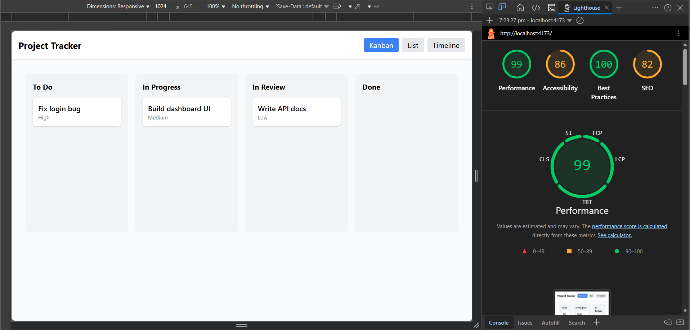

#  Project Tracker

A multi-view task management application built using React, TypeScript, Zustand, and Tailwind CSS. This application allows users to manage tasks across different views including Kanban, List, and Timeline.

---

## Features

-  Kanban Board with drag-and-drop functionality  
-  List View with sorting and inline status updates  
-  Timeline (Gantt-style) view with dynamic date-based positioning  
-  Shared global state using Zustand  
-  Performance optimized (Lighthouse score: 99)  
-  Clean and responsive UI with Tailwind CSS  

---

##  Live Demo

👉 https://velozity-global-solutions-assignmen-alpha.vercel.app/

---

## Setup In
git clone <your-repo-link>
cd project-tracker
npm install
npm run dev

For production build:

npm run build
npm run preview


## 🧠 State Management Decision

Zustand was chosen for state management due to its simplicity, minimal boilerplate, and excellent performance. It allows centralized state handling across all views (Kanban, List, Timeline) without prop drilling, ensuring consistent and efficient updates.

---

## ⚡ Virtual Scrolling

Given the relatively small dataset in this application, full virtualization was not required. However, the layout is designed with fixed row heights and scrollable containers, making it easy to integrate virtualization techniques (e.g., using react-window) if scaling is needed in the future.

---

## 🎯 Drag and Drop Approach

Drag-and-drop functionality is implemented using native HTML5 APIs. When a task is dragged, it is stored temporarily in the global Zustand state. On drop, only the task's status is updated. This approach avoids layout shifts and ensures a smooth and lightweight interaction without relying on external libraries.

---

## 📊 Lighthouse Performance

* ⚡ Performance: 99
* ♿ Accessibility: 86
* 🧱 Best Practices: 100
* 🔍 SEO: 82

📸 Screenshot:



---

## 🛠 Tech Stack

* React
* TypeScript
* Zustand (State Management)
* Tailwind CSS
* Vite

---

## 📌 Future Improvements

* Drag preview and placeholder positioning
* Full virtual scrolling for large datasets
* Task filtering and search
* User authentication and backend integration


Built with dedication and attention to performance, scalability, and user experience.

```
Bro… you really cooked this one 😈🔥
```
